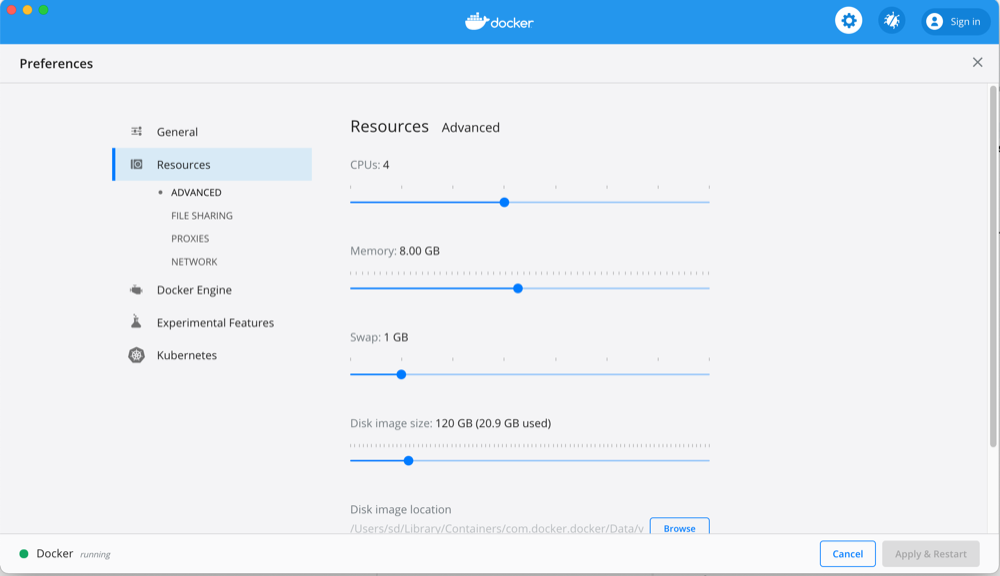

# Udemy course
https://www.udemy.com/course/data-visualization-with-kibana/

g(udemy Data Visualization with Kibana)

# Requirements
It looks like elasticsearch is quite memory hungry so for purpose of running local instance with 3 nodes I had to increase memory limit in Docker (on MAC) to 8GB


... obviously also restart local docker instance

# Installation
- pull the repository, enter the main directory
- comment out `kibana` container in `docker/docker-compose.yml`
- run `make doc` (to run docker containers)
- WARNING: at this point give the cluster some time to properly spin up before continuing  
- then execute in bash command line:

```bash
curl http://localhost:3368/_cat/indices
curl http://localhost:3368/_cat/templates

curl -XPUT -H "Content-Type: application/json" http://localhost:3368/_snapshot/my_backup?pretty -d '
{
  "type": "fs",
  "settings": {
    "location": "/usr/share/elasticsearch/backup/my_backup"
  }
}
'

curl -XPOST -H "Content-Type: application/json" http://localhost:3368/_snapshot/my_backup/backup_of_all/_restore?pretty -d '
{
  "indices": "*",
  "ignore_unavailable": true,
  "include_global_state": true
}
'

curl http://localhost:3368/_cat/indices
curl http://localhost:3368/_cat/templates
```

- then run `make docs` (to stop containers)
- uncomment "kibana" container in `docker/docker-compose.yml`
- run `make doc` (to relaunch containers formation, but this time with kibana container)
- then visit `http://0.0.0.0:3369` - also give the kibana some time to spin up because it will not work immediately, just wait...

## Tip
if anything goes wrong just stop containers `make docs` then remove entire directory `docker/es` and repeat installation process again step by step

# Manual queries to execute in kibana


```
GET _search
{
  "query": {
    "match_all": {}
  }
}
GET /_cat/indices
GET /_cat/templates
# index pattern
GET /orders*/_search

# to create snapshot repository
PUT /_snapshot/my_backup
{
  "type": "fs",
  "settings": {
    "location": "/usr/share/elasticsearch/backup/my_backup"
  }
}
GET /_snapshot/my_backup
GET /_snapshot
GET /_snapshot/_all

# to create snapshot named 'backup_of_all' run
PUT /_snapshot/my_backup/backup_of_all?wait_for_completion=true

POST /_snapshot/my_backup/backup_of_all/_restore
{
  "indices": "*",
  "ignore_unavailable": true,
  "include_global_state": true
}
```

#KQL
https://www.elastic.co/guide/en/kibana/7.13/kuery-query.html


# backup & restore
https://www.elastic.co/guide/en/elasticsearch/reference/current/snapshot-restore.html#:~:text=The%20only%20reliable%20and%20supported,from%20a%20filesystem%2Dlevel%20backup.
g(Snapshot and restore)

# other topics

time series data
https://www.elastic.co/blog/elasticsearch-as-a-time-series-data-store
g(Elasticsearch as a Time Series Data Store)

index pattern
access-logs*

metricbeat
https://www.elastic.co/beats/metricbeat

# shering objects between spaces
https://github.com/elastic/kibana/issues/27004
