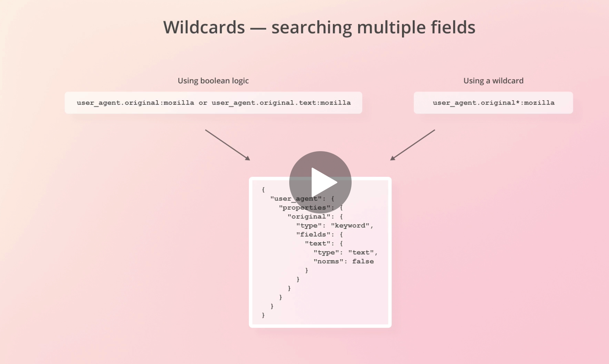

# Udemy course
https://www.udemy.com/course/data-visualization-with-kibana/

# manual queries to execute in kibana

GET _search
{
"query": {
"match_all": {}
}
}

GET _cat/indices

GET /_cat/templates

# index pattern
GET /orders*/_search

#KQL
https://www.elastic.co/guide/en/kibana/7.13/kuery-query.html

# setting up password:
https://www.elastic.co/guide/en/elasticsearch/reference/current/setup-passwords.html#setup-passwords

# other topics

time series data
https://www.elastic.co/blog/elasticsearch-as-a-time-series-data-store
g(Elasticsearch as a Time Series Data Store)

index pattern
access-logs*

metricbeat
https://www.elastic.co/beats/metricbeat

# shering objects between spaces
https://github.com/elastic/kibana/issues/27004